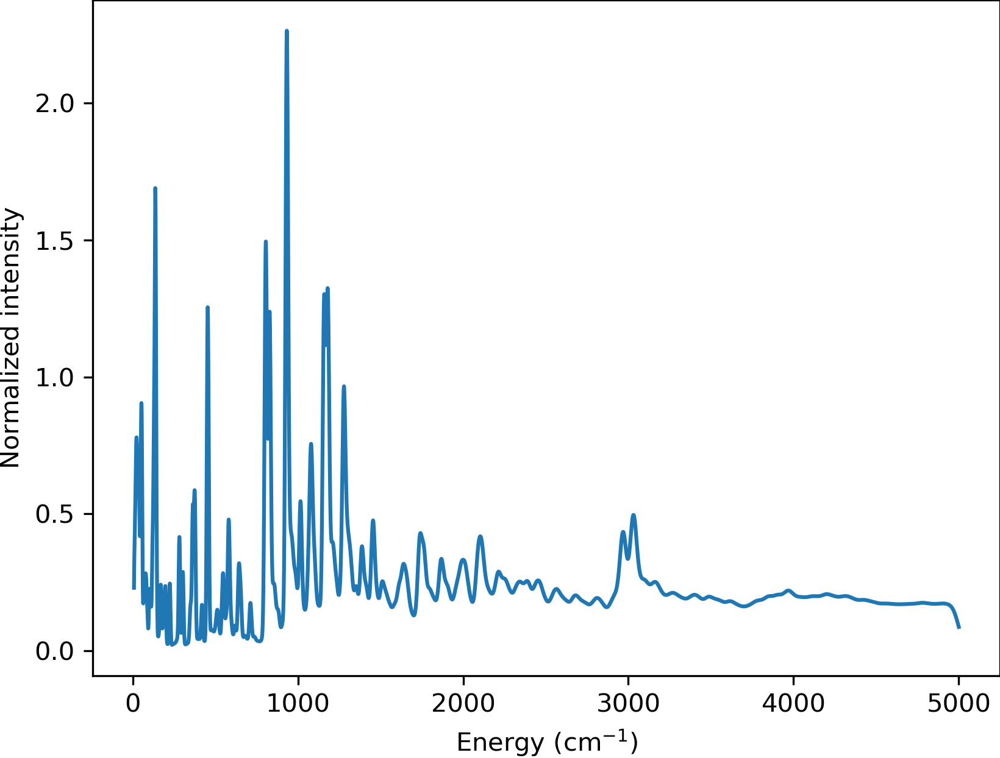

# Welcome to the repository for Adam Moule group - UC Davis

## Contents

* [Installation](https://gitlab.com/lucassamir1/adam-moule/-/tree/MacOSInstall#installation) 
* [Workflow](https://gitlab.com/lucassamir1/adam-moule/-/tree/MacOSInstall#workflow)
* [Documentation](https://gitlab.com/lucassamir1/adam-moule/-/tree/MacOSInstall#documentation)
* [Examples](https://gitlab.com/lucassamir1/adam-moule/-/tree/MacOSInstall#examples)


## Installation 

* [Linux Installation](https://gitlab.com/lucassamir1/adam-moule/-/blob/MacOSInstall/Install/Install_Linux.md)

* [MacOS Installation](https://gitlab.com/lucassamir1/adam-moule/-/blob/MacOSInstall/Install/Install_MacOS.md)


## Workflow Description

The Davis Computational Spectroscopy workflow (DCS-Flow) was designed to connect and automate different material sciences tools which facilitate the use and comparison of electronic methods such as DFT, DFTB and machine learning to simulate the structure and dynamics of materials properties for improved structure property prediction. DCS-Flow provides an efficient workflow to create databases of Inelastic Neutron Scattering simulations ([DCS Discover Database](https://ins-dashboard.uc.r.appspot.com/)).


In the figure above, we present an overview of the complete workflow of the DCS-Flow method. The main part of it is composed by steps in blue or that contain a blue gradient. With the experimental crystal structure file and a set of workflow parameters as inputs, we optimize the structure, simulate the lattice dynamics with the supercell method and calculate the INS spectrum. This is called the main workflow.

In the other hand, the red boxes represent the training workflow, in which the ChIMES model is employed. It starts with the optimization of the structure, followed by a DFT-MD simulation from which a training set of forces, stress tensors and energies is extracted. Finally, the ChIMES model is trained to this set creating coefficients that correct the DFTB calculations. The possibility of correcting the main workflow is represented by a red gradient.


## Documentation
DCS-Flow is a collection of the following scripts: 
* Relax: Optimizes structure.
* Phonons: Calculates phonons modes with the supercell method
* Oclimax: Runs oclimax simulation creating a INS sprectrum. 
* MD: Runs molecular dynamics simulations.
* Chimes: Creates the coefficients for the Chebyshev Interaction Model for Efficient Simulation. 
* Train: Automated workflow that calls the functions necessary to create the Chimes coefficients.
* Workflow: Automates the main workflow functions to relax structure, calculate phonons, and calculate the INS spectrum. 

DCS Flow has a command line interface implemented. Examples for how to use it are included under each main function. 

### Main Functions

#### Relax 
* ```relax(krelax=[6, 6, 6], fmax=0.05, geo=None, calc='dftbp'):```
    * Finds the geometry file and optimizes the structure using the specified calculator. 
    * The following input args are defined in the workflow parameters file:  
        * krelax (list, optional): Number of k points for relaxation. Defaults to [6, 6, 6].  
        * fmax (float, optional): Maximum allowed force for convergence between atoms. Defaults to 0.01.  
        * geo (str, optional): Geometry file or structure. 
            Allowed file types are .cif, .gen, .sdf, or .xyz. Defaults to None.  
        * calc (str, optional): Calculator used. Options are 'dftbp', 'chimes', 'castep', or 'vasp'. Defaults to 'dftbp'.  

```
cnss relax --krelax 6 6 6 --fmax 0.05 --geo TCNQ.cif --calc dftbp
```

#### Phonons
* ```phonons(dim=[4, 4, 4], kforce=[1, 1, 1], mesh=[8, 8, 8], calc='dftbp'):```
    * Runs phonon supercell displacement calculations, populates 2-phonons file with results. 
    * The following input args are defined in the workflow parameters file: 
        * dim (list, optional): Dimensions of the supercell. Defaults to [4, 4, 4].
        * kforce (list, optional): Number of k points for force calculations. Defaults to [1, 1, 1].
        * mesh (list, optional): Uniform meshes for each axis. Defaults to [8, 8, 8].
        * calc (str, optional): Calculator used for task. Options are 'dftbp', 'chimes', 'vasp', or 'castep'. Defaults to 'dftbp'.

``` 
cnss phonons --dim 4 4 4 --kforce 1 1 1 --mesh 8 8 8 --calc dftbp
```

#### Oclimax
* ```oclimax(params=None, task=0, e_unit=0):```
    * Creates folder 3-oclimax within wd and write params file using default values if no dict exist in folder
    * The following input args are defined in the workflow parameters file: 
        * params (str, optional): Oclimax parameters file defined in write_params function. Defaults to None.
        * task (int, optional): Defines approximation method. 
            0:inc approx. 1:coh+inc. 2:single-xtal Q-E. 3:single-xtal Q-Q. Defaults to 0.
        * e_unit (int, optional): Defines energy unit. Defaults to 0.

```
cnss oclimax --task 0 --e_unit 0
```

#### MD
*  ```md(optgeo=None, calc='vasp', T=300, md_size=[1,1,1], steps=5000, time_step=1, dump_interval=100):```
    * Runs md using vasp or castep; if other calculator specified, raises error.
    * The following inputs are defined in the training parameters file (train_params.json): 
        * optgeo (NoneType, optional): Optimized geometry file, only true if optgeo defined. Defaults to None.
        * calc (str, optional): Specifies calculator.Options are 'vasp' or 'castep'. Defaults to 'vasp'.
        * T (int, optional): Simulation temperature. Defaults to 300.
        * md_size (list, optional): Size of supercell. Defaults to [1,1,1].
        * steps (int, optional): Maximum number of ionic steps. Defaults to 5000.
        * time_step (int, optional): Md time step in fs. Defaults to 1. 
        * dump_interval (int, optional): Step size. Defaults to 100. 

``` 
cnss md --calc vasp --T 300 --md_size 1 1 1 --steps 5000 --time_step 1 --dump_interval 100
```

#### Chimes
* ```chimes(trajfile=None, b2=12, b3=8, T=5):``` [e] 
    * Calls multi_fmatch (calculates force difference) and fm_setup_input () functions to create Chebyshev Interaction Model and creates 3-chimes folder. [e]
    * The following inputs are required:
        * trajfile (list, optional): Trajectory file output from md simulation. Defaults to None.
        * b2 (int, optional): Second body order of Chebyshev polynomial. Defaults to 12.
        * b3 (int, optional): Third body order of Chebyshev polynomial. Defaults to 8.
        * T (int, optional): Temperature for simulation in Kevin. Defaults to 5.

``` 
cnss chimes --b2 12 --b3 8 --T 5
```

#### Train
* ```train(dct=None):```  
    * Calls chosen calculator with a timer using specified parameters, else with default parameters.
    * The following input is required:
        * dct (dict, optional): Specified parameters for relax, md, and chimes functions. Defaults to None.

``` 
cnss train
```

#### Workflow
* ```workflow(dct=None):```
    * Calls all workflow functions with a timer using specified parameters, else with default parameters.
    * The following input dictionary is the workflow parameters files: 
        * dct (dict, optional): Specified parameters for relax, phonons, and oclimax functions. Defaults to None.

```
cnss workflow
```


## Examples

__Main Workflow using DFTB+ for TCNQ on PC__:  

The following example shows the primary workflow using dftb+ as the calculator run on a personal terminal (as opposed to a super computer). 

First, create a folder containing the geometry file (.cif, .gen, .sdf, or .xyz). The folder used in this example, named TCNQ, can be downloaded here: [e]  

In the TCNQ folder, create the workflow parameters file, ```workflow_params.json```, using the following command.  

``` python
cnss workflow --get-params
```  

Edit the workflow parameters file to match the following values. Check the [Workflow Parameters Selection](https://gitlab.com/lucassamir1/adam-moule/-/blob/MacOSInstall/README.md#workflow-parameters-selection) for information on how values can be selected. 

```
{
    "krelax": [
        4,
        4,
        2
    ],
    "fmax": 0.05,
    "geo": null,
    "calc": "dftbp",
    "dim": [
        2,
        2,
        1
    ],
    "kforce": [
        1,
        1,
        1
    ],
    "mesh": [
        8,
        8,
        8
    ],
    "params": null,
    "task": 0,
    "e_unit": 0
}
```  

The TCNQ folder, or current directory, now has the structure file (tcnq.cif) and the edited parameters file (workflow_params.json). Use the following command to begin the calculation: 

``` python
cnss workflow
```  

Once the job has completed, the following files can be found in the TCNQ folder.  
```
1-optimization		3-oclimax		err.out			run_tcnq.py
2-phonons		PREFIX.out		out.out			workflow_params.json
```  

Open the 3-oclimax folder and click on the png file to view to INS specta. 



---

__Main Workflow using DFTB+ for TCNQ on NERSC__:  

The following example shows the primary workflow using dftb+ as the calculator on NERSC.  

First, there is no need of installation of the DCS-Flow package and its dependencies. Just access the super computer via the terminal, and load the CNSS module using the following commands:\

``` python
module use /global/common/software/m2734/cnss/modulefiles
module load cnss
```  

You can add these commands to your bashrc file in your NERSC home folder to load the CNSS module every time you access NERSC.

Create a folder containing the geometry file (.cif, .gen, .sdf, or .xyz) and a run_tcnq.py bash script (for NERSC). This folder, named TCNQ, can be downloaded here: [e]  

Upload the TCNQ folder to NERSC using a file transfer software like Globus.

Inside the TCNQ directory, create the workflow parameters file, ```workflow_params.json```, using the following commands.  

``` python
cd TCNQ
cnss workflow --get-params
```  

Edit the workflow parameters file to match the following values. Check the [Workflow Parameters Selection](https://gitlab.com/lucassamir1/adam-moule/-/blob/MacOSInstall/README.md#workflow-parameters-selection) for information on how values can be selected. 

```
{
    "krelax": [
        4,
        4,
        2
    ],
    "fmax": 0.05,
    "geo": null,
    "calc": "dftbp",
    "dim": [
        2,
        2,
        1
    ],
    "kforce": [
        1,
        1,
        1
    ],
    "mesh": [
        8,
        8,
        8
    ],
    "params": null,
    "task": 0,
    "e_unit": 0
}
```  

The TCNQ folder, or current directory, now has the structure file (tcnq.cif), the edited parameters file (workflow_params.json), and the run script (run_tcnq.py.). The run_tcnq.py bash script contains information for the NERSC super computer such as number of allocated nodes, processors and run hours. The final lines contain the commands to be evaluated, in this case ```eval $'cnss workflow'```.  

Submit the job and check it's progress using the following commands:

``` python
sbatch run_tcnq.py
sqs
```  

Once the job has completed, the following files can be found in the TCNQ folder.  
```
1-optimization		3-oclimax		err.out			run_tcnq.py
2-phonons		PREFIX.out		out.out			workflow_params.json
```  

Use a file transfer software like Globus to transfer the wanted files to your personal computer. Open the 3-oclimax folder and click on the png file to view to INS specta. The resulted INS spectrum will be the same as simulated in the example before.
 
---

__Training and Main Workflow for TCNQ-TTF__:  [e] 
- explain how to start
1. generate a parameters train_params.json - edit so it says castep + other params
2. run --> params.txt
3. change workflow params to chimes 
4. run main workflow with params.txt --> generate INS spectra 

- after running training workflow, can run main workflow - but change calculator to chimes
make sure params.txt in folder, change workflow_params.json calc to 'chimes' 

file params.txt (chimes parameters type file created) 

### Workflow Parameters Selection
- add in guidance for how to choose krelax, fmax, geo, dim, kforce, mesh, task, e_unit values [e]
- consider adding training params file info [e] 

- add example folder (TCNQ_PC, TCNQ_NERSC, TCNQ-TTF_Train) 